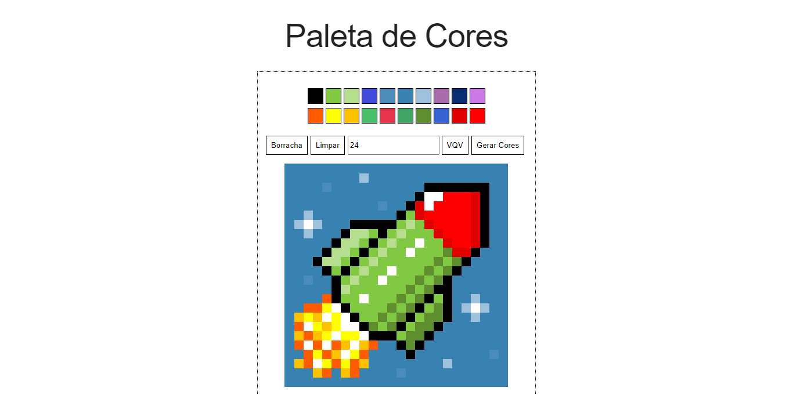

  


## 📗 Sobre

Projeto desenvolvido após as aulas de JavaScript, onde aprendemos a trabalhar com elementos, eventos e web storage.

Dois projetos foram desenvolvidos neste bloco: **Pixels Art** e **ToDo List**.

**Módulo**: Fundamentos do Desenvolvimento Web

**Bloco**: JavaScript: DOM, Eventos e Web Storage

## 🚀 Demo

https://rafaelgeronimo.me/trybe-project-pixels-art/

## 🖼 Captura de tela



## 🛠 Instalação

- Realize o clone do projeto com o comando:
```bash
git clone git@github.com:rafaelgeronimo/trybe-project-pixels-art.git
```
- Entre na pasta do projeto:
```bash
cd trybe-project-pixels-art
```
- Não é necessário instalar o projeto, basta executar o arquivo `index.html` na raíz do mesmo, e o sistema abrirá no navegador padrão do seu sistema.

## 💻 Tecnologias

Este projeto foi desenvolvido com as seguintes tecnologias:


## 📝 Requisitos do Projeto

<details>
  <summary>
    1. A página deve possuir o título "Paleta de Cores"
  </summary>
  As seguintes verificações serão feitas:
  <ul>
    <li>
      O título deverá ficar dentro de uma tag <kbd>h1</kbd> com o <kbd>id</kbd> denominado <kbd>title</kbd>;
    </li>
    <li>
      O texto do título deve ser <strong>exatamente</strong> "Paleta de Cores".
    </li>
  </ul>
</details>
<details>
  <summary>
    2. A página deve possuir uma paleta de cores distintas
  </summary>
  As seguintes verificações serão feitas:
  <ul>
    <li>
      A paleta de cores deve ser um elemento com <kbd>id</kbd> denominado <kbd>color-palette</kbd>, ao passo que cada cor individual da paleta de cores deve possuir a <kbd>classe</kbd> <kbd>color</kbd>;
    </li>
    <li>
      A cor de fundo de cada elemento da paleta deverá ser a cor que o elemento representa. <strong>A única cor não permitida na paleta é a cor branca</strong>;
    </li>
    <li>
      Cada elemento da paleta deverá ter uma borda preta, sólida e com 1 pixel de largura;
    </li>
    <li>
      A paleta de cores deverá listar todas as cores disponíveis para utilização lado a lado, e deverá ser posicionada abaixo do título "Paleta de Cores";
    </li>
    <li>
      A paleta de cores não deve conter cores repetidas.
    </li>
  </ul>
</details>
<details>
  <summary>
    3. A cor presta deve ser a primeira na paleta de cores.
  </summary>
  As seguintes verificaçÕes serão feitas:
  <ul>
    <li>
      As demais cores podem ser escolhidas livremente.
    </li>
  </ul>
</details>
<details>
  <summary>
    4. A página deve possuir um quadro de pixels, com 625 pixels.
  </summary>
  As seguintes verificaçÕes serão feitas:
  <ul>
    <li>
      O quadro de "pixels" deve ter 25 elementos de largura e 25 elementos de comprimento;
    </li>
    <li>
      O quadro de "pixels" deve possuir o <kbd>id</kbd> denominado <kbd>pixel-board</kbd>, ao passo que cada "pixel" individual dentro do quadro deve possuir a <kbd>classe</kbd> denominada <kbd>pixel</kbd>;
    </li>
    <li>
      A cor inicial dos "pixels" dentro do quadro, ao abrir a página, deve ser branca;
    </li>
    <li>
      O quadro de "pixels" deve aparecer abaixo da paleta de cores.
    </li>
  </ul>
</details>
<details>
  <summary>
    5. Cada elemento do quadro de pixels deve possuir 40 pixels de largura e 40 pixels de altura e ser delimitado por uma borda de 1 pixel.
  </summary>
  As seguintes verificações serão feitas:
  <ul>
    <li>
      O quadro de pixels tem altura e comprimento de 5 elementos;
    </li>
    <li>
      40 pixels deve ser o tamanho total do elemento, incluindo seu conteúdo e excluindo a borda preta, que deve ser criada à parte.
    </li>
  </ul>
</details>
<details>
  <summary>
    6. Ao carregar a página, a cor preta da paleta já deve estar selecionada para pintar os pixels.
  </summary>
  As seguintes verificações serão feitas:
  <ul>
    <li>
      O elemento da cor preta deve possuir, inicialmente, a <kbd>classe</kbd><kbd>selected</kbd>;
    </li>
    <li>
      Note que o elemento que deverá receber a classe <kbd>selected</kbd> deve ser um dos elementos que possuem a classe <kbd>color</kbd>, como especificado no <strong>requisito 2</strong>.
    </li>
  </ul>
</details>
<details>
  <summary>
    7. Ao clicar em uma das cores da paleta, a cor selecionada é que vai ser usada para preencher os pixels no quadro.
  </summary>
  As seguintes verificações serão feitas:
  <ul>
    <li>
      A <kbd>classe</kbd><kbd>selected</kbd> deve ser adicionada à cor selecionada na paleta, ao mesmo tempo em que é removida da cor anteriormente selecionada;
    </li>
    <li>
      Somente uma das cores da paleta deve ter a <kbd>classe</kbd><kbd>selected</kbd> de cada vez;
    </li>
    <li>
      Note que os elementos que deverão receber a classe <kbd>selected</kbd> devem ser os mesmos que possuem a classe <kbd>color</kbd>, como especificado no <strong>requisito 2</strong>.
    </li>
  </ul>
</details>
<details>
  <summary>
    8. Ao clicar em um pixel dentro do quadro após selecionar uma cor na paleta, o pixel deve ser preenchido com esta cor.
  </summary>
  As seguintes verificaçÕes serão feitas:
  <ul>
    <li>
      Ao carregar a página deve ser possível pintar os pixels de preto;
    </li>
    <li>
      Após selecionar uma outra cor na paleta, deve ser possível pintar os pixels com essa cor;
    </li>
    <li>
      Somente o pixel que foi clicado deverá ser preenchido com a cor selecionada, sem influenciar na cor dos demais pixels.
    </li>
  </ul>
</details>
<details>
  <summary>
    9. Crie um botão que, ao ser clicado, limpa o quadro preenchendo a cor de todos seus pixels com branco.
  </summary>
  As seguintes verificaçÕes serão feitas:
  <ul>
    <li>
      O botão deve ter o <kbd>id</kbd> denominado <kbd>clear-board</kbd>;
    </li>
    <li>
      O botão deve estar posicionado entre a paleta de cores e o quadro de pixels;
    </li>
    <li>
      O texto do botão deve ser "<strong>Limpar</strong>".
    </li>
  </ul>
</details>

### Requisitos bônus

<details>
  <summary>
    10. Faça o quadro de pixels ter seu tamanho definido pelo usuário.
  </summary>
  As seguintes verificaçÕes serão feitas:
  <ul>
    <li>
      Crie um input e um botão que permitem definir um quadro de pixels com tamanho entre 5 e 50. Ao clicar no botão, deve ser gerado um quadro de <strong>N</strong> pixels de largura e <strong>N</strong> pixels de altura, onde <strong>N</strong> é o número inserido no input;
    </li>
    <li>
      Ou seja, se o valor passado no input for 7, ao clicar no botão, vai ser gerado um quadro de 49 pixels (7 pixels de largura x 7 pixels de altura);
    </li>
    <li>
      O input deve ter o <kbd>id</kbd> denominado <kbd>board-size</kbd> e o botão deve ter o <kbd>id</kbd> denominado <kbd>generate-board</kbd>;
    </li>
    <li>
      O input só deve aceitar números maiores que zero. Essa restrição <strong>deve</strong> ser feita usando os atributos do elemento <kbd>input</kbd>;
    </li>
    <li>
      O botão deve conter o texto "VQV";
    </li>
    <li>
      O input deve estar posicionado entre a paleta de cores e o quadro de pixels;
    </li>
    <li>
      O botão deve estar posicionado ao lado do input;
    </li>
    <li>
      Se nenhum valor for colocado no input ao clicar no botão, mostre um <kbd>alert</kbd> com o texto: "Board inválido!";
    </li>
    <li>
      O novo quadro deve ter todos os pixels preenchidos com a cor branca.
    </li>
  </ul>
</details>
<details>
  <summary>
    11. Limite o tamanho mínimo e máximo do board.
  </summary>
  As seguintes verificaçÕes serão feitas:
  <ul>
    <li>
    Caso o valor digitado no input <kbd>board-size</kbd> fuja do intervalo de 5 a 50, faça:
      <ul>
        <li>
          Valor menor que 5, considerar 5 como padrão;
        </li>
        <li>
          Valor maior que 50, considerar 50 como padrão.
        </li>
      <ul>
    </li>
  </ul>
</details>
<details>
  <summary>
    12. Faça com que as cores da paleta sejam geradas aleatoriamente ao carregar a página.
  </summary>
  As seguintes verificaçÕes serão feitas:
  <ul>
    <li>
      A cor preta ainda precisa estar presente e deve ser a primeira na sua paleta de cores.
    </li>
  </ul>
</details>
